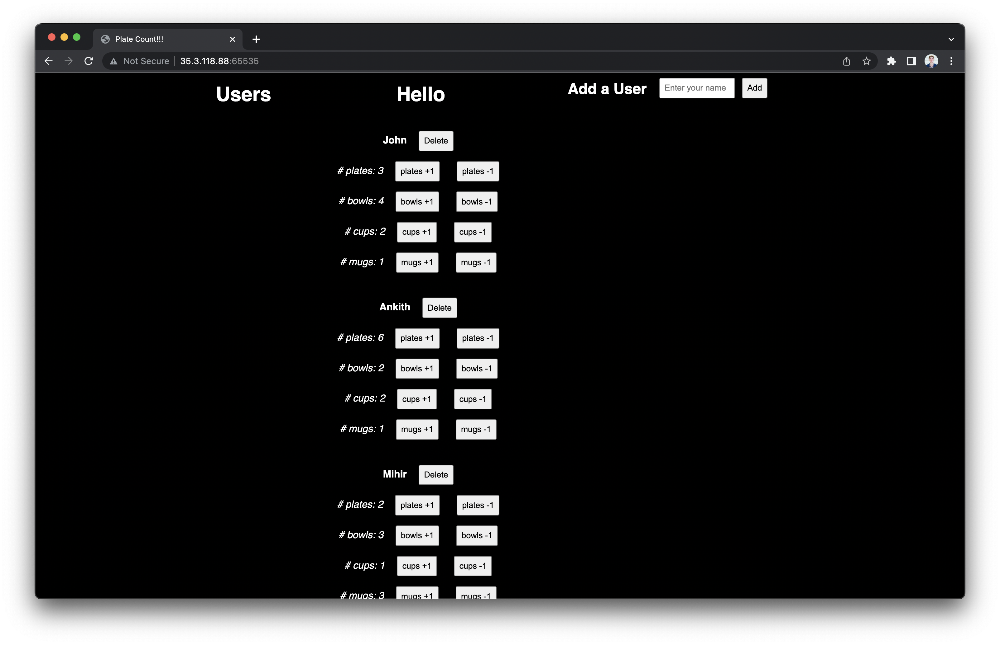

# Dining-Tracker
a simple website to track how many dishes a user has used at the dining hall.

## Purpose  
This project was built to track the number of dishes that my friends and I used in our challenge to stay in the dining hall for 12 hours straight.

## Demo

## Technologies
The web app was made using python's Flask and for a backend used storing info to a csv file (non-optimal for production but this is just a demo).

The users can have an arbitrary amount of parameters that can be incremented and decremented.

## Acknowledgements
A JohnWare Project
